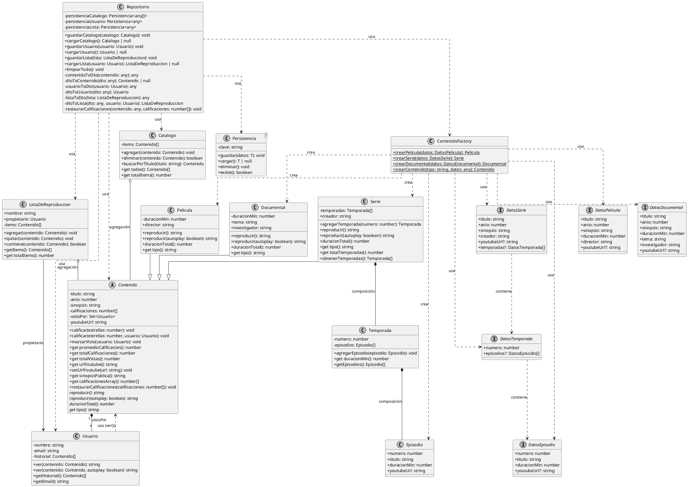

# Factory Method - Nocturno Streaming Platform

## 📋 Introducción

Este documento explica la implementación del patrón **Factory Method** en la plataforma de streaming Nocturno. El patrón se integró de forma natural en la arquitectura existente para centralizar la creación de instancias de contenido (Películas, Series, Documentales).

## 🎯 ¿Qué es el Factory Method?

El **Factory Method** es un patrón de diseño creacional que define una interfaz para crear objetos, pero delega la responsabilidad de instanciar clases concretas a las subclases. En este caso, implementamos una variación usando una clase estática `ContenidoFactory` que encapsula toda la lógica de creación.

## 🏗️ Arquitectura de la Implementación

### Ubicación del Factory
```
src/services/contenidoFactory.ts
```

### Componentes Principales

#### 1. **ContenidoFactory** (Clase Factory)
- Responsabilidad única: Crear instancias de `Contenido`
- Métodos estáticos para cada tipo de contenido:
  - `crearPelicula(datos: DatosPelicula): Pelicula`
  - `crearSerie(datos: DatosSerie): Serie`
  - `crearDocumental(datos: DatosDocumental): Documental`
  - `crearContenido(tipo: string, datos: any): Contenido` (método genérico)

#### 2. **Interfaces de Datos**
- `DatosPelicula`: Define estructura para crear películas
- `DatosSerie`: Define estructura para crear series (incluye temporadas)
- `DatosDocumental`: Define estructura para crear documentales
- `DatosTemporada`: Define estructura para temporadas
- `DatosEpisodio`: Define estructura para episodios

## 🔧 Integración en la Arquitectura Existente

### Antes del Factory Method
La creación de contenido estaba dispersa en múltiples lugares:

```typescript
// ❌ En events.ts (formularios de creación)
const nuevaPelicula = new Pelicula(titulo, anio, sinopsis, duracion, director, youtubeUrl);
const nuevaSerie = new Serie(titulo, anio, sinopsis, creador, youtubeUrl);
const nuevoDocumental = new Documental(titulo, anio, sinopsis, duracion, tema, investigador, youtubeUrl);

// ❌ En seed.ts (datos iniciales)
const pelicula1 = new Pelicula('The Matrix', 1999, '...', 136, 'Directores', 'url');

// ❌ En repositorio.ts (deserialización desde localStorage)
const pelicula = new Pelicula(dto.titulo, dto.anio, dto.sinopsis, dto.duracionMin, dto.director, dto.youtubeUrl);
```

### Después del Factory Method
Toda la creación está centralizada en `ContenidoFactory`:

```typescript
// ✅ En events.ts
const datosPelicula: DatosPelicula = { titulo, anio, sinopsis, duracionMin, director, youtubeUrl };
const nuevaPelicula = ContenidoFactory.crearPelicula(datosPelicula);

// ✅ En seed.ts
const datosPelicula1: DatosPelicula = { titulo: 'The Matrix', anio: 1999, ... };
const pelicula1 = ContenidoFactory.crearPelicula(datosPelicula1);

// ✅ En repositorio.ts
const contenido = ContenidoFactory.crearContenido(dto.tipo, dto);
```

## 📊 Puntos de Uso del Factory

### 1. **Eventos de UI** (`src/ui/events.ts`)
- `onAgregarPelicula`: Crea películas desde el formulario
- `onAgregarSerie`: Crea series desde el formulario (con temporadas)
- `onAgregarDocumental`: Crea documentales desde el formulario

### 2. **Datos de Ejemplo** (`src/seed.ts`)
- Creación de contenido inicial para la aplicación
- Estructura de datos con temporadas y episodios para series

### 3. **Repositorio** (`src/services/repositorio.ts`)
- Deserialización de contenido desde localStorage
- El método `dtoToContenido` usa el factory genérico

## 💡 Beneficios Obtenidos

### 1. **Centralización de Lógica de Creación**
- Un solo lugar para modificar cómo se crean los objetos
- Facilita debugging y mantenimiento

### 2. **Type Safety**
- Interfaces específicas para cada tipo de contenido
- El compilador TypeScript valida que todos los campos requeridos estén presentes

### 3. **Extensibilidad (Open/Closed Principle)**
- Para agregar un nuevo tipo de contenido (ej: Podcast):
  1. Crear la clase `Podcast extends Contenido`
  2. Agregar método `crearPodcast` en `ContenidoFactory`
  3. Agregar caso en `crearContenido`
  4. Sin modificar código existente

### 4. **Consistencia**
- Validación y lógica de pre/post-creación en un solo lugar
- Reduce duplicación de código

### 5. **Testabilidad**
- Fácil de mockear en tests unitarios
- Lógica de creación aislada

## 🎓 Conceptos POO/UML Demostrados

### Factory Method (Patrón Creacional)
- **Encapsulamiento**: Oculta la complejidad de instanciación
- **Single Responsibility**: Responsabilidad única de crear objetos
- **Open/Closed**: Abierto para extensión, cerrado para modificación

### Integración con Patrones Existentes
- **Herencia**: Factory crea subclases de `Contenido`
- **Polimorfismo**: Factory retorna instancias polimórficas de `Contenido`
- **Encapsulamiento**: Datos privados de clases con acceso controlado

## 🔄 Flujo de Creación

```
Usuario interactúa con formulario
        ↓
Event handler (events.ts)
        ↓
Prepara datos en interfaces (DatosPelicula, DatosSerie, etc.)
        ↓
ContenidoFactory.crearPelicula/datos()
        ↓
Crea instancia con new Pelicula()
        ↓
Retorna instancia de Contenido
        ↓
Agrega al catálogo y persiste
```

## 📝 Ejemplo Completo de Uso

### Crear una Película
```typescript
import { ContenidoFactory, DatosPelicula } from './services/contenidoFactory';

const datosPelicula: DatosPelicula = {
    titulo: 'Inception',
    anio: 2010,
    sinopsis: 'Un ladrón que roba secretos corporativos...',
    duracionMin: 148,
    director: 'Christopher Nolan',
    youtubeUrl: 'https://youtube.com/watch?v=...'
};

const pelicula = ContenidoFactory.crearPelicula(datosPelicula);
catalogo.agregar(pelicula);
```

### Crear una Serie con Temporadas
```typescript
import { ContenidoFactory, DatosSerie } from './services/contenidoFactory';

const datosSerie: DatosSerie = {
    titulo: 'Breaking Bad',
    anio: 2008,
    sinopsis: 'Un profesor de química...',
    creador: 'Vince Gilligan',
    youtubeUrl: 'https://youtube.com/watch?v=...',
    temporadas: [
        {
            numero: 1,
            episodios: [
                { numero: 1, titulo: 'Pilot', duracionMin: 49 },
                { numero: 2, titulo: 'Cat\'s in the Bag...', duracionMin: 48 }
            ]
        }
    ]
};

const serie = ContenidoFactory.crearSerie(datosSerie);
catalogo.agregar(serie);
```

### Crear desde DTO (Repositorio)
```typescript
const dto = {
    tipo: 'Pelicula',
    titulo: 'The Matrix',
    anio: 1999,
    sinopsis: '...',
    duracionMin: 136,
    director: 'Wachowski',
    youtubeUrl: '...',
    calificaciones: [5, 5, 4]
};

const contenido = ContenidoFactory.crearContenido(dto.tipo, dto);
contenido.restaurarCalificaciones(dto.calificaciones);
```

## 🎨 Registro en Bitácora

La aplicación registra cuando se usa el Factory Method en la bitácora POO/UML:

```
[14:32:15] FACTORY METHOD   Película "Inception" creada usando ContenidoFactory
[14:32:15] HERENCIA        Nueva instancia de Pelicula creada extendiendo Contenido
[14:32:15] POLIMORFISMO     Película "Inception" agregada al catálogo
```

## 🚀 Conclusión

La implementación del Factory Method en Nocturno demuestra cómo un patrón de diseño puede integrarse de forma natural en una arquitectura existente, mejorando la mantenibilidad y extensibilidad sin comprometer la funcionalidad existente. El patrón se siente orgánico en este contexto porque la creación de diferentes tipos de contenido es una operación frecuente que beneficia de centralización y validación consistente.

---

## 📊 Diagrama de Clases PlantUML

Copia y pega este código en cualquier herramienta que soporte PlantUML (https://plantuml.com/):



### Leyenda del Diagrama

| Símbolo | Relación | Significado |
|---------|----------|-------------|
| `--|>` | Herencia | Subclase extiende superclase |
| `*--` | Composición | Ciclo de vida compartido (parte muere si el todo muere) |
| `o--` | Agregación | Referencias sin propiedad (parte puede existir independientemente) |
| `-->` | Asociación | Relación débil entre clases |
| `..>` | Dependencia | Clase usa otra pero no es miembro |
| `implements` | Implementación | Clase implementa interfaz |

### Notas sobre las Relaciones

1. **Herencia**: `Pelicula`, `Serie`, `Documental` extienden `Contenido` (clase abstracta)
2. **Composición**: `Serie` compone `Temporada`, `Temporada` compone `Episodio` (ciclo de vida compartido)
3. **Agregación**: `Catalogo` y `ListaDeReproduccion` agregan `Contenido` (referencias sin propiedad)
4. **Asociación**: `Usuario` se asocia con `Contenido` a través del historial y método `ver()`
5. **Dependencia**: `Repositorio` depende de `Persistencia`, `ContenidoFactory` y clases de dominio
6. **Factory Method**: `ContenidoFactory` depende de las clases concretas que crea y de las interfaces de datos
